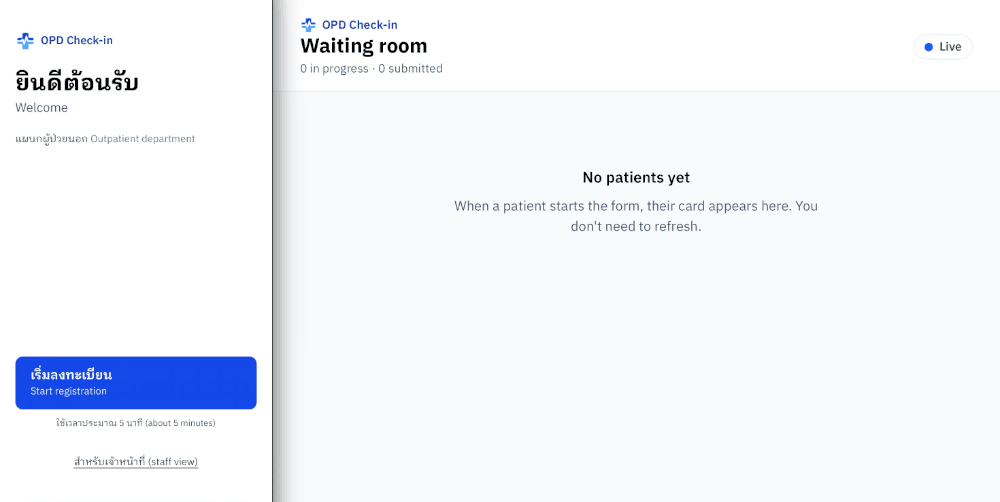
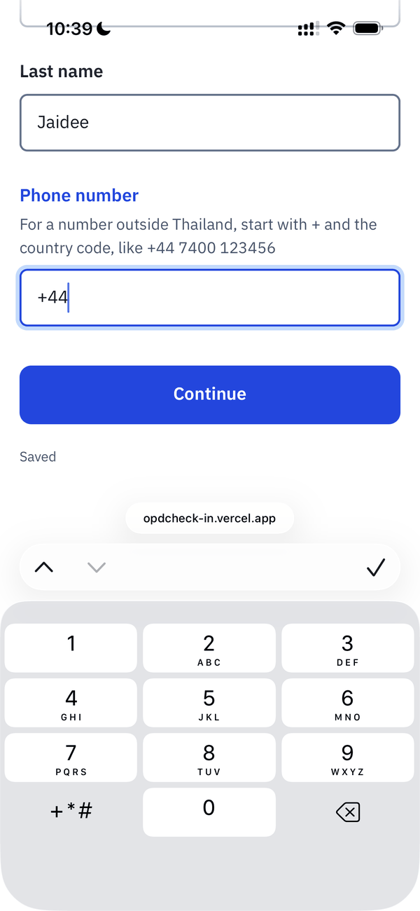
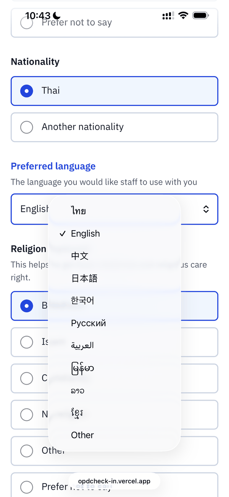
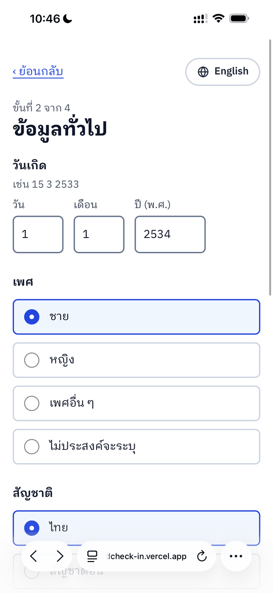
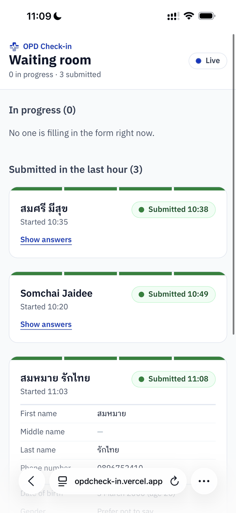
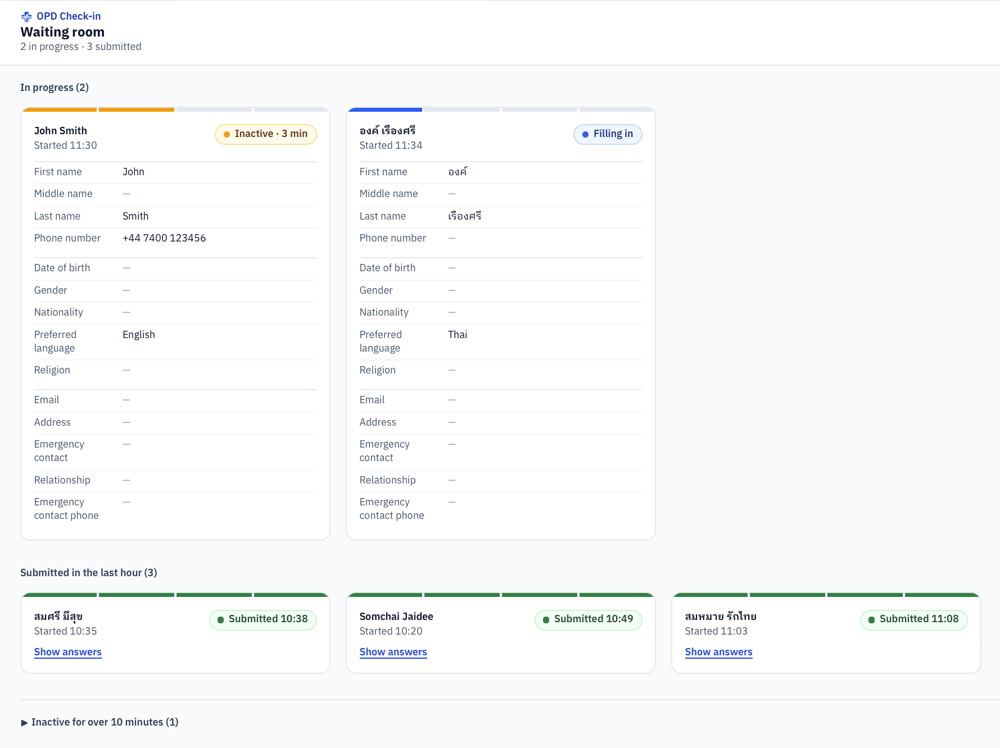
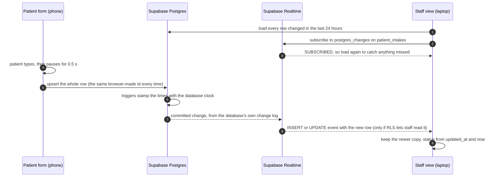

# OPD Check-in

[](https://github.com/thepalai/patient-intake-realtime/actions/workflows/ci.yml)

A patient checks in on their own phone while staff watch each answer arrive, live, on another screen. Every patient's card shows whether they are **filling in**, **inactive** or have **submitted**.



- **Live:** https://opdcheck-in.vercel.app
- **Try it:** open [`/patient`](https://opdcheck-in.vercel.app/patient) on a phone and [`/staff`](https://opdcheck-in.vercel.app/staff) on a laptop, then start the form. A card appears within a few seconds of choosing a language, and each answer follows about a second after you stop typing. Cards leave the staff view 24 hours after their last change, so it may be empty when you first open it.
- **Stack:** Next.js 16 (App Router, JavaScript), Tailwind CSS v4, Supabase (Postgres and Realtime), hosted on Vercel.

Built as a front-end take-home assignment. The demo holds made-up data only.

## Contents

- [Requirements coverage](#requirements-coverage)
- [Getting started](#getting-started)
- [Assumptions](#assumptions)
- [Development planning](#development-planning): [project structure](#project-structure), [design across screen sizes](#design-uiux-across-screen-sizes), [component architecture](#component-architecture), [real-time synchronization flow](#real-time-synchronization-flow)
- [Security model](#security-model) and [data model](#data-model)
- [Bonus features](#bonus-features)
- [Production considerations](#production-considerations) and [known limitations](#known-limitations)
- [How it was verified](#how-it-was-verified), [how I built this](#how-i-built-this) and the [build log](#build-log)

## Requirements coverage

| Requirement | Status | Where |
|---|---|---|
| Patient form with all twelve fields; middle name, emergency contact and religion optional | ✅ | [`lib/fields.js`](lib/fields.js) lists them once for the form, the review page and the staff card; [`components/IntakeForm.js`](components/IntakeForm.js) |
| Validation: required fields, phone number, email | ✅ | [`lib/validation.js`](lib/validation.js), unit-tested in [`lib/validation.test.js`](lib/validation.test.js) |
| Patient form works on mobile and desktop | ✅ | [Design](#design-uiux-across-screen-sizes), tested on an iPhone and a laptop |
| Staff view shows every field in real time as the patient types | ✅ | [`components/WaitingRoom.js`](components/WaitingRoom.js), [`components/IntakeCard.js`](components/IntakeCard.js), [`lib/useLiveIntakes.js`](lib/useLiveIntakes.js) |
| Staff view adapts to screen size | ✅ | one to five columns of cards, see [Design](#design-uiux-across-screen-sizes) |
| Status for each patient: submitted, filling in or inactive | ✅ | [`lib/intakeStatus.js`](lib/intakeStatus.js), [`components/IntakeStatus.js`](components/IntakeStatus.js) |
| Real-time sync between the two views | ✅ | Supabase Realtime over WebSockets, see [Real-time synchronization flow](#real-time-synchronization-flow) |
| Next.js and Tailwind CSS | ✅ | Next.js 16 (App Router), Tailwind CSS v4 |
| Deployed on a frontend cloud platform | ✅ | Vercel, [live URL](https://opdcheck-in.vercel.app) |
| README and development planning documentation | ✅ | this file |

## Getting started

You need Node.js 20.9 or later (CI and Vercel use Node 24) and a Supabase project (the free tier is enough).

```bash
git clone https://github.com/thepalai/patient-intake-realtime.git
cd patient-intake-realtime
npm install
```

1. In the Supabase dashboard, open the **SQL Editor** and run [`supabase/schema.sql`](supabase/schema.sql) once, on a new project. It creates the table, privileges, RLS policies, realtime publication and two triggers. It sets every privilege explicitly, so the result doesn't depend on the project's default settings.
2. Copy `.env.example` to `.env.local` and fill in the project URL and **publishable** key (both are in the dashboard under Project Settings):

   ```bash
   NEXT_PUBLIC_SUPABASE_URL=https://<project-ref>.supabase.co
   NEXT_PUBLIC_SUPABASE_PUBLISHABLE_KEY=sb_publishable_...
   ```

3. Run `npm run dev` and open http://localhost:3000.

`npm test` runs the unit tests (Vitest), `npm run lint` runs ESLint and `npm run build` makes a production build. CI runs all three on every push.

**Deploying to Vercel:** add the same two variables under Project Settings → Environment Variables. The `NEXT_PUBLIC_` prefix tells Next.js to inline the values into the browser bundle **at build time**, so a changed variable only takes effect after a redeploy.

## Assumptions

- **Many patients at once.** Several patients can fill in the form at the same time, as in a real outpatient department, and the staff view shows all of them. One form session is one row.
- **No login.** Authentication isn't part of the brief, so `/patient` and `/staff` are separated by route, not by permission. The demo holds made-up data only; see [Production considerations](#production-considerations).
- **Email is optional.** The brief asks for email validation where it applies, and many older patients have no email address. If one is given, it must be valid.
- **The emergency contact has a phone number too.** A name and relationship alone don't let staff reach anyone, so the optional emergency contact also takes a phone number, checked like the patient's own.
- **Inactive** means no change for 30 seconds.
- **Staff watch; they don't edit.** The staff view is read-only and nothing can be deleted from it. Clearing old rows is an admin task in the Supabase dashboard.
- **The staff view is about the people still filling in.** Submitted and abandoned cards fold away over time, so a busy screen shows mostly the patients who may need help.
- **The landing page is a demo convenience.** In a clinic, a QR code or kiosk would open `/patient` directly.

## Development planning

### Project structure

```
app/
  layout.js              root layout: font, page language, page title template
  globals.css            Tailwind, font, card fade-in, light-only colour scheme
  page.js                landing page, Thai first and English second (demo entry point)
  icon.svg, favicon.ico, apple-icon.png   the tab and home-screen icons
  patient/page.js        patient form page (server component: layout and metadata)
  staff/page.js          staff page (server component: metadata)
components/
  IntakeForm.js          the patient flow: language page → steps 1–3 → check answers → thank-you
  WaitingRoom.js         staff screen: header, connection badge, sections, card grids
  IntakeCard.js          one patient's card: progress strip, status, answers
  IntakeStatus.js        status pill, progress strip and the status colours
  LiveBadge.js           connection status pill
  LogoMark.js            the OPD Check-in mark (the same drawing as app/icon.svg)
  form/
    LanguagePage.js      ไทย / English choice
    StepFields.js        the fields of one step, grouped fields under a heading
    InputField.js        text, phone, email, address and dropdown
    RadioField.js        large radio rows, with a text box for "other"
    DateField.js         day / month / year boxes
    FieldParts.js        label, hint and error message, in GOV.UK order
    Review.js            check your answers before sending
    ThankYou.js          confirmation that clears itself after 30 seconds
lib/
  supabase.js            one shared Supabase client
  fields.js              steps and fields: labels in Thai and English, codes, rules
  intakeRow.js           answers ↔ database row, dates and calendars, how answers read
  validation.js          validateStep: required answers, names, phone, email, date of birth
  useAutosave.js         debounced, one-at-a-time save with retries, and submit()
  useLiveIntakes.js      load the last 24 hours, subscribe, merge
  intakeStatus.js        status rules and their timings
  useNow.js              the staff page's one clock
  *.test.js              unit tests (Vitest), next to the file each one tests
supabase/
  schema.sql             table, privileges, RLS policies, realtime publication, triggers
docs/                    the demo GIF and screenshots in this README
.github/workflows/ci.yml lint, test and build on every push
vitest.config.mjs        test setup (repeats the @ import shortcut from jsconfig.json)
```

Pages stay thin server components. Everything interactive sits under two client components, `IntakeForm` and `WaitingRoom`. Code that draws things lives in `components/`, and code that decides things (validation, turning answers into a row, status timings) is plain functions in `lib/`, which is why that is where the unit tests are.

### Design (UI/UX across screen sizes)

Guiding principles: clean, consistent, clear. Form patterns follow the GOV.UK Design System, adapted with what I learned about real patients as a radiology assistant.

**Patient form: designed for a phone first**

- **One column, big targets.** On a phone the form fills the screen. From 640px it sits in a centred panel no wider than 36rem, because long lines are harder to read. Choices are full-width bordered rows, easy to hit with a thumb.
- **Four short steps** (personal details, about you, contact details, check your answers) rather than one long page, with "Step 2 of 4" at the top. Each step is a browser history entry, so the phone's back gesture goes to the previous step with every answer kept, instead of leaving the form.
- **The right keyboard for each field:** a phone keypad (which has +) for phone numbers, a number pad for the date, an email keyboard for email. Text in the fields is 18px, which also stops iPhones zooming in when a field is tapped (they zoom below 16px).
- **Date of birth as three boxes** (day, month, year), as in GOV.UK's date input: quicker than scrolling a date picker back decades. The Thai form asks for the Buddhist Era year (พ.ศ.), and switching language converts it.
- **Thai and English.** The form opens on a language page with each language written in its own script. A switch at the top right of every step changes language without losing answers. The preferred-language question offers ten languages, including those of many migrant-worker patients (Burmese, Lao, Khmer).
- **Errors say how to fix them.** Label, hint, error, then input (GOV.UK order); a red bar marks the field, and focus moves to the first one. Sending checks every step once more, so an answer changed after going back is checked too.
- **Nothing is lost.** Answers save as the patient types, with the state under the form: "Saving…", "Saved", or "Couldn't save yet. Trying again…".
- **Shared tablets:** the thank-you page clears itself after 30 seconds, ready for the next person.
- **Readable type:** IBM Plex Sans Thai Looped, whose looped Thai letters are easier to tell apart for older patients, and whose Latin letters match.

| Phone keypad with + | Languages in their own script | Thai form with a พ.ศ. year | Staff view on a phone |
|---|---|---|---|
|  |  |  |  |

**Staff view: designed for a desk or a wall screen, works on a phone**

- **As many cards as the screen fits.** There is no maximum width: one column on a phone, two from 768px, three from 1280px, four from 1536px and five from 1920px.
- **Sections in the order staff act on them:** In progress, then Submitted in the last hour, then two folded sections at the bottom: Submitted over an hour ago, and Inactive for over 10 minutes (forms most likely left behind). A card returns to the queue as soon as its patient types again.
- **A queue, oldest first.** New patients join the end, so cards never jump around.
- **Each card:** a strip of four segments shows the step, a status pill, and every answer grouped by step, with a thin line instead of a heading to keep cards short. Dates of birth show the age. A new submission stays open for 2 minutes, then closes to its header with "Show answers".
- **A calm screen.** Nothing blinks and no seconds tick. Colour appears only in the status (blue filling in, amber inactive, green submitted) and always with words. An inactive card counts whole minutes since the last change ("Inactive · 3 min"), the same clock that folds it away at 10 minutes. New cards fade in over 0.4 seconds, unless the device asks for reduced motion.
- **Tried and dropped:** a yellow flash on the field that just changed. With twenty patients typing at once, the screen would flicker all day; staff don't act on typing; and it doesn't help with the patients who matter most, the ones who have stopped.
- **Connection badge:** Live, Reconnecting… or Connecting…, so staff know whether the screen is up to date.



**Light theme only.** Outpatient departments keep the lights on while they are open, and in a bright room dark text on a light background is the easiest to read; screen brightness is the display's job. The pages are locked to light (`color-scheme: light`), so a phone in dark mode doesn't turn the dropdowns dark.

### Component architecture

```
app/patient/page.js (server)
└─ IntakeForm (client): a new key per patient = fresh answers and a new row id
   └─ IntakeSession: answers, step, language, errors, history; useAutosave
      ├─ LanguagePage
      ├─ StepFields → InputField / RadioField / DateField (built from FieldParts)
      ├─ Review
      └─ ThankYou

app/staff/page.js (server)
└─ WaitingRoom (client): useLiveIntakes (data) + useNow (clock) → groups
   ├─ LiveBadge
   └─ Section / Folded → CardGrid → IntakeCard → IntakeStatus, ProgressStrip
```

- **One list of fields.** [`lib/fields.js`](lib/fields.js) describes every field once (step, kind, labels in Thai and English, options, rules). The form, the review page and the staff card all render from it, so a field is added or renamed in one place.
- **Codes are stored, words are shown.** Choices are saved as short English codes (`female`, `th`) and turned into words for each reader by `displayAnswer`, so the data reads the same whichever language the patient used.
- **Three hooks hold the side effects.** `useAutosave` owns saving (debounce, one request at a time, retries, submit). `useLiveIntakes` owns the staff data (load, subscribe, merge). `useNow` is the staff page's one clock.
- **Rules are plain functions.** `validateStep`, `toRow`, `withLanguage`, `intakeStatus` and `statusLabel` take plain values and return plain values, so they are unit-tested without React, a browser or a database. The status rules take the current time as an argument; the date-of-birth rules read the clock themselves, so their tests set a fake one.

### Real-time synchronization flow



- **Transport.** The staff page subscribes to `postgres_changes` on `patient_intakes`. Supabase Realtime streams the database's committed changes over a WebSocket, so the staff view shows exactly what is stored: one source of truth, nothing to keep in sync by hand. It is also a managed service, so on Vercel there is no long-running server of my own holding sockets open.
- **Saving.** The browser makes each row's UUID, so the first save and every later one are the same upsert: insert if new, update if not. Saves wait for a half-second pause in typing, and go one at a time, because two overlapping requests can land in either order and an older one landing last would overwrite newer answers. A failed save shows a message and retries every 3 seconds. Submitting waits for any save already on its way, then sends the final answers with `submitted_at`.
- **One clock for every time on screen.** Database triggers stamp `updated_at`, `step_started_at` and `submitted_at` with the database clock, never the patient's phone. The staff page has one timer, ticking every second, and every status and label is worked out from the row and that moment. No card runs a timer of its own, so there is nothing per card to clean up.
- **Realtime has no memory.** It only delivers changes made while connected, so the staff view loads the rows when it opens and again every time the channel reports `SUBSCRIBED`, which includes every reconnect. Loads and events can arrive in either order, so the view keeps whichever copy of a row has the later `updated_at`.
- **Reconnecting.** The client sends a heartbeat every 25 seconds and reconnects after 1, 2, 5, then 10 seconds, while the badge shows Reconnecting…. A connection that drops silently can take up to about 50 seconds to notice.
- **Lifecycle.** The channel is created inside `useEffect` and removed in its cleanup with `supabase.removeChannel`. In development, React Strict Mode runs every effect, then its cleanup, then the effect again, which proves the cleanup works.
- **Publication and RLS.** The table is in the `supabase_realtime` publication. Realtime respects Row Level Security: without the select policy, the subscription connects and then stays silent, with no error.
- **Measured on the live URL:** a new card appeared about 2.5 seconds after the patient chose a language (the first save also opens the connection), and after that each answer followed about a second behind the typing.

## Security model

With no login, both pages talk to Supabase using the **publishable key**, and requests made with it run as the Postgres role `anon`. The key is public by design (it ships in the JavaScript bundle), so everything the browser may do is decided inside the database, by two independent layers:

| Layer | Decides | When it's missing |
|---|---|---|
| `GRANT` (table privileges) | which **commands** `anon` may run | the request fails with `42501 permission denied` |
| Row Level Security policies | which **rows** a permitted command can reach | reads and updates quietly match **0 rows**, with no error (inserts are rejected) |

I tested each state on its own before moving on: no grant → `42501`; a grant but no policy → 0 rows; grant and policy → the row comes back.

What [`supabase/schema.sql`](supabase/schema.sql) sets up:

- **Revoke everything, then grant three commands.** The script starts with `revoke all … from anon, authenticated`, then grants `anon` only `select`, `insert` and `update`, which is all the two pages use. Depending on project settings, Supabase can grant the API roles *every* privilege on a new table, including `DELETE` and `TRUNCATE`, and RLS doesn't apply to `TRUNCATE`. Revoking first keeps the public role at least privilege and gives the same result on any project.
- **No delete at either layer.** Neither patients nor staff delete intakes, so there is no `delete` grant and no delete policy.
- **RLS enabled, with three policies `to anon`:** select, insert and update.
- **Realtime respects RLS.** The staff page only receives change events for rows its role can `SELECT`.

> ⚠️ The policies use `using (true)`, so anyone holding the public key can read and change every intake. That is acceptable **only** because the demo holds made-up data. See [Production considerations](#production-considerations).

## Data model

One table, `patient_intakes`, with **one row per form session** and 20 columns (full definition in [`supabase/schema.sql`](supabase/schema.sql)):

| Column | Purpose |
|---|---|
| `id` | UUID primary key, made by the browser |
| `first_name`, `middle_name`, `last_name`, `phone_number`, `date_of_birth`, `gender`, `nationality`, `preferred_language`, `religion`, `email`, `address`, `emergency_contact_name`, `emergency_contact_relationship`, `emergency_contact_phone` | the answers. Choices hold short English codes; an "other" answer holds the patient's own words; a blank answer is `null` |
| `current_step` | the step the patient is on: 1 to 3, or 4 while checking their answers |
| `step_started_at` | when they reached that step, by the database clock. The card no longer shows it; it is kept to measure where patients get stuck |
| `submitted_at` | when they submitted, by the database clock; the first submission time is kept |
| `created_at` | when the form started, which sets the queue order |
| `updated_at` | the last change, by the database clock on every update; drives filling in, inactive and the 24-hour window |

- **Why a UUID:** a patient has no hospital number (HN) yet at intake. A random UUID also doesn't reveal how many intakes exist, and can't be guessed once reads are locked down in production.
- **Why no `NOT NULL` on the answers:** with live sync, a row is saved while the patient is still typing, so an incomplete row is the normal state rather than an error. Required-field rules belong to the form, not to the database.
- **A date is saved only once it is a real, possible one,** so staff never see half a date, or a year typed in the wrong calendar.

## Bonus features

Beyond what the brief asks for:

- **Thai and English,** switchable at any step without losing answers, with Buddhist Era years on the Thai form converted when switching.
- **Phone numbers from any country** ([libphonenumber-js](https://github.com/catamphetamine/libphonenumber-js)): Thai by default, and a number starting with + is checked against its own country's rules.
- **Names in any script,** including Thai vowels and tone marks; email addresses written in Thai are accepted too, while a pasted `mailto:` link is not.
- **Check your answers** before sending, with a Change link for each section.
- **Back gesture moves between steps** without losing answers.
- **Autosave with a visible state** and automatic retries; a submit that fails offline says so and can be sent again.
- **Staff view extras:** a progress strip per card, sections that fold submitted and abandoned cards away, a rolling 24-hour window, a live connection badge, and cards that fade in.
- **Accessibility:** hints and errors are linked to their inputs; focus moves to each new step's heading or to the first error; the save state is announced to screen readers; Thai and English text is marked with its language; colour is never the only signal.
- **84 unit tests and CI** on every push.
- **A logo and favicon** of my own design.

## Production considerations

This is a demo without login. Before it handled real patient data, I would change:

- **Authentication and ownership.** Staff sign in with Supabase Auth; patients get an anonymous session. Policies then check `auth.uid()`: a patient can read and update only their own intake, and only staff can read everyone's. Sessions also close today's open insert: right now anyone with the key can create rows, whereas signed-in writes can be tied to a user and rate-limited.
- **Locked after submitting.** Today the form stops saving once it is sent, and the trigger keeps the first submission time, but the public key could still change the other columns. An update policy would refuse any change once `submitted_at` is set.
- **Sensitive data under Thailand's PDPA.** Religion is sensitive personal data (PDPA Section 26), so it stays optional, with a note on why it is asked. Production would add explicit consent and access only for staff who need it.
- **Keep data only as long as it is needed.** A scheduled `pg_cron` job would delete abandoned forms quickly, and keep submitted ones only until they have moved into the hospital's own system.
- **Staff actions and queue numbers.** A "called" button for staff, and queue numbers from the hospital's queue system.
- **Pick up where you left off.** A reload or a closed tab starts a new form today. Keeping the answers in `sessionStorage` with an expiry would let a patient continue, without showing them to the next person on a shared tablet.
- **More help on the form.** A second emergency contact, a country list next to the phone number, and address lookup from the postcode.
- **Checks in the database as well.** Length limits and `CHECK` constraints, so the rules hold even for requests that don't come from the form.
- **Staff screens with a wrong clock.** Statuses compare the database clock with the staff device's clock; Realtime's `commit_timestamp` could correct a device whose clock has drifted.
- **More languages** for the whole interface, starting with those of migrant-worker patients (Burmese, Lao, Khmer).
- **Entry point.** The landing page's two buttons are a demo convenience; in a clinic, a QR code or kiosk would open `/patient` directly.
- **A dark theme** if it were used on wards at night.

## Known limitations

- **Birthdays run on UTC.** "Today" in the date-of-birth rules changes at midnight UTC, which is 07:00 in Thailand. Between midnight and 07:00, a baby born that day reads as born in the future, and the age on a card is one year short during the first seven hours of a birthday.
- **Leaving the form starts over.** Going back past the first step, closing the tab or reloading starts a new row; the old card folds away after 10 minutes.
- **Email is checked for format only,** as with any form: an address can look right and still not exist. Only a confirmation email would prove it.
- **A silent disconnect** can take up to about 50 seconds to notice (see [Reconnecting](#real-time-synchronization-flow)).

## How it was verified

- **Unit tests:** 84 [Vitest](https://vitest.dev) tests on the rules in `lib/` (validation 39, rows and dates 25, status timings 20), through the functions the app calls and focused on the edges: exactly 30 seconds, 10 minutes, 24 hours, calendars, impossible dates. While the tests were written, the rules were broken on purpose in 20 places, and a test failed every time.
- **CI:** GitHub Actions runs `npm ci`, lint, the tests and a production build on every push, on Node 24 like Vercel, with a read-only token.
- **Real devices, on the live URL:** an iPhone and a laptop side by side. Checked the keyboard for each field, no zoom when a field is tapped, every language name rendering (including Burmese, Lao and Khmer), the back gesture, switching language mid-form, mobile data instead of Wi-Fi, sending while in airplane mode and again once back online, and the staff view on the phone.
- **Losing the connection:** with the laptop's Wi-Fi off, the badge changed to Reconnecting…; a phone number typed meanwhile appeared on the card after it came back, without a refresh.
- **Found on a real phone:** an address starting with `mailto:` passed the email check. The rule now turns away spaces and the characters RFC 5322 reserves, with tests for both the fix and addresses written in Thai.
- **During development,** Claude also ran browser automation (Playwright against a mocked Supabase) to check layouts at phone widths from 320px and the time-based rules; those scripts are not in this repo.

## How I built this

I used Claude (Anthropic's AI assistant) throughout, and told the reviewers so by email. To be precise about who did what:

- **Day 1: database, security, deployment.** I wrote this code myself, with Claude teaching and reviewing.
- **Day 2 onward: the UI, the triggers, the tests and CI.** To fit the three-day window, most of this code is written by Claude from my decisions. I review every diff before committing and test on real devices. These commits carry a `Co-authored-by: Claude` trailer.
- **[`supabase/schema.sql`](supabase/schema.sql):** the first version of the table, the privileges and the policies are mine (Day 1), comments included. The comments on the `updated_at` trigger are mine too: I wrote them first, then Claude lightly edited the wording and kept my phrasing. The columns added for the full form and the second trigger, `stamp_intake_progress`, are Claude's, comments included.
- **The logo:** I chose the shape and colours; Claude drew it as an SVG.
- **This README:** drafted by Claude from my decisions and test results; I reviewed it section by section.
- **Decisions.** Scope and order, the data model, the security model, the real-time approach and the UI/UX choices are mine: for example four steps instead of one long page, the oldest-first queue, folding away abandoned cards, dropping the field highlight, optional email, and accepting email addresses written in Thai. Claude often laid out the options; I chose, and I can explain each choice.

## Build log

Three lines at the end of each step.

**Day 1 — foundation**
- **Did:** deployed the Next.js + Tailwind scaffold to Vercel on day one; set up the Supabase table, privileges, RLS policies and realtime publication; built a staff page that logs live changes.
- **Decided:** Supabase `postgres_changes` for real-time; security enforced in the database (grants + RLS), because the browser key is public.
- **Verified:** each security layer on its own (error → 0 rows → 1 row), and a change made in the dashboard reaching the staff page on the live URL.

**Day 2 — thin slice**
- **Did:** a patient form (names and phone) that saves itself as the patient types, a staff waiting room whose cards update live, a landing page, and a trigger that keeps `updated_at` current.
- **Decided:** the browser creates each row's UUID, so every save is the same upsert, sent one at a time with retries; the staff view loads on open and after every reconnect, and keeps whichever copy of a row is newer.
- **Verified:** on the live URL, one row per patient (an INSERT, then UPDATEs); locally, cards appear in queue order, update and disappear live; eslint and the production build pass.

**Day 3 — the full form and the staff view**
- **Did:** the four-step patient form with validation, a review page and submit; a language page with a Thai/English switch; and a staff view that shows each patient's step, time on it and status, and folds away submitted and abandoned cards over time.
- **Decided:** every time on screen comes from the database clock (triggers) and one page clock, so no card runs a timer of its own; email is optional, because the brief asks for email validation where applicable and many older patients have no email; cards leave the staff view 24 hours after their last change rather than at midnight, because a hospital runs through the night.
- **Verified:** on the live URL, the staff view recovered after the laptop's Wi-Fi dropped, and a phone number typed while it was offline appeared without a refresh; back and forward move between steps without losing answers; switching language keeps every answer, including the birth year across calendars.

**Day 3, evening — tests, CI and a calmer staff view**
- **Did:** unit tests for the rules in `lib/`, CI on every push, and a calmer staff view: the time in each step gave way to whole minutes of silence on inactive cards only, and new cards fade in.
- **Decided:** test the rules through the functions the app calls, with the edges in mind; drop a yellow "just changed" highlight after building it, because twenty patients typing would make the screen flicker all day and staff don't act on typing.
- **Verified:** every rule broken on purpose made a test fail; CI's first run passed in 32 seconds; the new labels on the live URL.

**Day 4 — real devices and documentation**
- **Did:** tested on an iPhone and a laptop over the live URL, recorded the demo, fixed the email rule it exposed, and wrote this README.
- **Decided:** the email rule turns away spaces and RFC 5322's reserved characters, which catches a pasted `mailto:` link, but still accepts addresses written in Thai; the screenshots and demo use made-up data only.
- **Verified:** keyboards, the back gesture, language switching, mobile data, sending offline and the staff view on a phone; a new card appears about 2.5 seconds after a patient picks a language, then follows about a second behind the typing.
